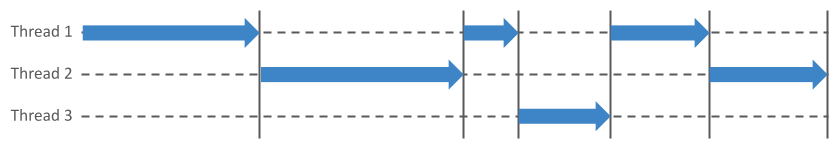
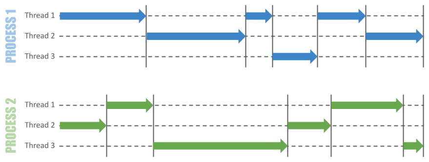

# Python Concurrency Demo

This repository is a demo of how to implement concurrency in Python applications.
Python 3.8 or above is required to run the code, which is exposed as modules
that can be executed from the command line.

Each executable module runs a service comprised of a number of workers running
a number of randomly-generated jobs. Each job is CPU-bound, and workers pick
jobs in succession from a shared queue. 

There are three methods of concurrency implemented, which demonstrate the three
basic types of concurrency available to Python applications: threads, processes, 
and coroutines. Each of these methods has trade-offs against the others, and
all are implemented here using a very similar structure in order to highlight
the differences. It is highly recommended to read the code to understand how
each works.

**Note: the three forms of concurrency highlighted here are not generally
compatible with each other. While some overlap exists in places, it is
recommended to stick to a single method per application.**

Several command line options are available to fine tune the behaviour of the modules:

- `--jobs=N` - set the number of jobs on the shared queue (default=20)
- `--seed=N` - set a random seed allowing jobs to be similar across runs
- `--time=N` - set the number of seconds for which the service should run (default=10)
- `--workers=N` - set the number of workers available to the service (default=4)


## The Global Interpreter Lock (GIL)

> In CPython, the global interpreter lock, or GIL, is a mutex that protects access to Python objects, preventing multiple threads from executing Python bytecodes at once.
>
> -- <cite>https://wiki.python.org/moin/GlobalInterpreterLock</cite>

Due to the presence of the GIL in CPython, there are significant differences
between the various forms of concurrency available. Thread-based concurrency
will not generally speed up CPU-bound workloads since each Python process allows
only one piece of bytecode to be executing at any given moment.

Multiple processes can therefore be used to avoid the GIL, but come with other
challenges, wherein [objects cannot be trivially exchanged between processes](https://docs.python.org/3/library/multiprocessing.html#exchanging-objects-between-processes). 


## Synchronization primitives

Each demo module uses a `Lock` object which is locked while the service is running.
Due to incompatibilities across the methods of concurrency, however, three different
`Lock` classes are available in Python: `threading.Lock`, `multiprocessing.Lock` and
`asyncio.Lock`. It is important to be aware of which of these should be used for any
given scenario.

The semantics of each `Lock` class are similar, but the `multiprocessing.Lock` class
is missing a `locked()` method which the code here simulates.

Each of the three standard library modules mentioned above also provides a number of
other synchronization primitives, such as _Conditions_, _Events_ and _Semaphores_.
Again, these are not compatible across concurrency methods.


## Queues

Each Python concurrency module also has a different implementation available for managing
a queue: `queue.Queue` (for threading), `multiprocessing.Queue` and `asyncio.Queue`.
The semantics of each are similar, but differ slightly. For example, the `asyncio.Queue`
does not accept a `timeout` argument, relying instead on the `asyncio.wait_for` function.


## Thread-based concurrency

To run the threading demo, use:
```shell script
$ python -m demo.threads
```

Thread-based concurrency centres mainly around the Python `threading` module.
This is generally the simplest form of concurrency to work with, as it is both
very mature and can allow objects to be shared easily. The primary trade-off is
that - due to the GIL (mentioned above) - only one thread can be executing code at
any given point in time.

The diagram below shows an abstract view of multiple threads taking turns to
execute code. Each vertical bar denotes a switch wherein one thread releases the
GIL and another acquires it. 



The simplest way to implement thread-based concurrency in Python is to either use the 
the `threading.Thread` class directly, or to extend it and override the `run()` 
method. This demo uses the base `Thread` class, passing it a target function.

Threads can be started with the `start()` method and the flow of execution merged
back into the main thread with the `join()` method.

Note that some standard library components outside of the `threading` module
are marked as _thread-safe_. For example, `collections.deque`, `queue.Queue` and
the `logging` module are all safe to use in a multi-threaded application.

For more information on thread-based concurrency, read the Python documentation on the 
[threading module](https://docs.python.org/3/library/threading.html).


## Process-based concurrency

To run the multiprocessing demo, use:
```shell script
$ python -m demo.processes
```

Process-based concurrency can _sometimes_ be more performant than thread-based
concurrency, but this depends heavily on the type of workload. It is
however typically more fraught with issues of complexity. Internally to Python,
the mechanisms used to spawn processes vary by underlying operating system,
which can affect the portability of applications.

To illustrate this, the process-based demo here accepts a further command line
option, `--method`, which can be used to explicitly set the start method for 
child processes. The value can be either `fork`, `spawn` or `forkserver` and
the default differs by operating system. More information on the differences
between these start methods can be found in the 
[Python documentation](https://docs.python.org/3/library/multiprocessing.html#contexts-and-start-methods).
 
Multi-processing generally avoids GIL issues, as each process maintains its own GIL:



The trade-off with this approach, however, is the relative complexity of sharing
objects between processes. This typically relies on the built-in `multiprocessing.Pipe`
class which allows two-way socket-style communication between processes, which
of course requires all objects to be serializable as byte streams.

The `multiprocessing.Queue` class (as used in this demo) is built on top of
a `Pipe`, and as such requires all queued items to be
[picklable](https://docs.python.org/3/library/pickle.html).

For more information on process-based concurrency, read the Python documentation on the 
[multiprocessing module](https://docs.python.org/3/library/multiprocessing.html).


## Coroutine-based concurrency

To run the coroutines demo, use:
```shell script
$ python -m demo.coroutines
```
